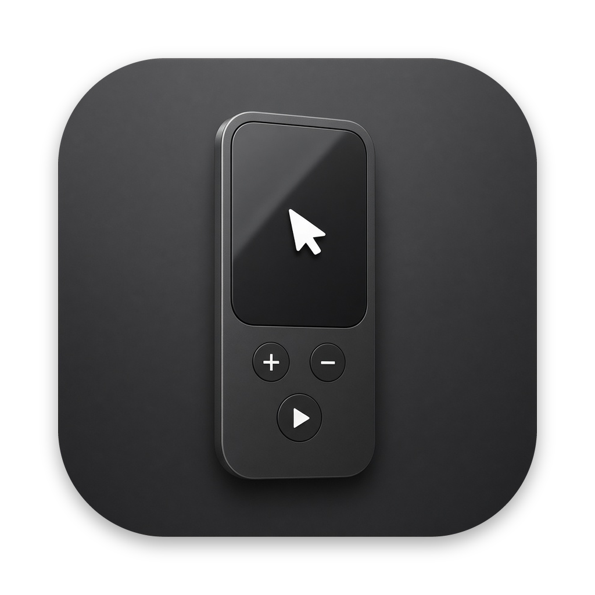

<p align="center"></p>

# SiriMouse

A native macOS menu bar app that turns a **1st-generation Siri Remote** (2015, black glass touch
surface) into a presenter clicker, a media remote and a mouse.

## Download

Website: **https://smugzombie.github.io/SiriMouse/**


Grab `SiriMouse-x.y.z.zip` from [Releases](https://github.com/SmugZombie/SiriMouse/releases),
unzip it and move **SiriMouse.app** to /Applications. It is a universal app (Apple silicon and Intel);
`SiriMouse-x.y.z-arm64.zip` is a smaller Apple silicon-only build. Releases are signed and notarized.

## Pair the remote with your Mac

1. If it is paired with an Apple TV, unpair it there first (or keep that Apple TV powered off).
2. Open **System Settings → Bluetooth** on the Mac.
3. Hold the remote close to the Mac and press and hold **Menu + Volume Up** for about 5 seconds.
4. Click **Connect** when "Remote" / "Siri Remote" appears.

## Build and run

Requires macOS 13+ and the Xcode command line tools (`swift`).

```sh
./build.sh --run            # build into ./build and launch
./build.sh --arm64          # Apple silicon only (default: universal)
./build.sh --install --run  # copy to /Applications first (needed for Launch at Login)
./release.sh 1.0.0          # notarize and publish a GitHub release (needs a Developer ID
                            # certificate and `xcrun notarytool store-credentials notary`)
```

On first launch, grant **Input Monitoring** (to read the remote) and **Accessibility** (to send
keys and move the pointer) in System Settings → Privacy & Security. The menu shows what is missing.
The build signs with your Apple Development / Developer ID certificate when one exists, so the
grants survive rebuilds; with ad-hoc signing you have to grant them again after each build.

## Controls

Switch modes with the **TV** button (or hold **Menu**). The menu bar icon and an on-screen HUD
show the current mode.

| Input | Presenter | Mouse | Media | Keyboard |
|---|---|---|---|---|
| Click surface | Next slide (left third: previous) | Left click; hold and slide to drag | Play/Pause | Type highlighted key |
| Swipe left / right | Previous / next slide | — | Previous / next track | Move between keys |
| Swipe up / down | Up / down arrow | — | Volume | Move between keys |
| Slide finger | — | Move pointer (right edge: scroll) | — | Move between keys |
| Play/Pause | Play/Pause | Right click | Play/Pause | Delete |
| Menu | Esc | Esc | Esc | Esc |
| Volume +/− | Volume | Volume | Volume | Volume |
| Siri | Open Siri, or hold to dictate | same | same | same |

Presenter mode sends arrow keys and Esc, which Keynote, PowerPoint, Google Slides and PDF viewers
all understand.

Keyboard mode shows an on-screen keyboard above the Dock. It types into the frontmost app without
taking focus, and its keys can also be clicked with a mouse.

## Voice

macOS does not give apps the 1st-gen remote's microphone audio (projects that get it sniff
Bluetooth packets with root privileges), so the **Siri button uses the Mac's microphone**:

- **Open Siri** (default): starts Siri, as if you clicked its icon. Siri must be enabled.
- **Dictate Text**: hold Siri, speak, release. The text is typed into the frontmost app, using
  on-device speech recognition when available. It asks for Microphone and Speech Recognition access.

## How it works

- **Buttons**: `IOHIDManager` opens the remote's HID interfaces, seized where macOS allows so the
  system does not also act on them. If one cannot be seized, a `CGEventTap` drops the duplicate
  system media key.
- **Touch surface**: macOS exposes the remote's touch surface as a multitouch device. It is read
  through the private `MultitouchSupport` framework, which is loaded at runtime and checked
  symbol by symbol. If a future macOS changes it, touch stops working but buttons keep working.
- Unrecognized buttons are logged to `~/Library/Logs/SiriMouse/SiriMouse.log` (menu → Open Log).
  Turn on **Verbose Logging** to see every button and gesture.

Touch-surface and HID usage details come from [VibeRemote](https://github.com/mengdream/VibeRemote) (MIT).

## License

MIT, see [LICENSE](LICENSE). Third-party code is listed in [THIRD_PARTY_NOTICES.md](THIRD_PARTY_NOTICES.md).
